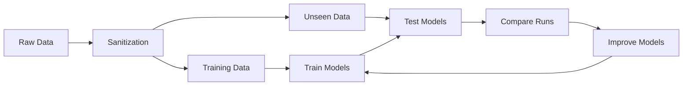

# Unseen Data Model Validation Guide

## Overview

The `real-world-model-test.py` script has been updated to test your trained models on **unseen data** - data that was filtered out during the sanitization process and never used for training. This provides a robust validation of model performance on edge cases and problematic records.

## What is "Unseen Data"?

Unseen data consists of records that were removed during sanitization because they:
- Were duplicates
- Had invalid dispositions (not confirmed/candidate/false positive)
- Had out-of-range numerical values
- Had excessive missing data

This data is perfect for testing model robustness because it represents real-world edge cases and data quality issues.

## Prerequisites

Before running the test, you need to have:

1. **Generated unseen data** by running the sanitizers:
   ```bash
   cd Backend/sanitization
   python run_all_sanitizers.py
   ```
   This will create:
   - `Backend/data/unseen/k2_unseen.csv`
   - `Backend/data/unseen/koi_unseen.csv`
   - `Backend/data/unseen/toi_unseen.csv`

2. **Trained models** saved in `Backend/ml_pipeline/models/`

3. **Preprocessing artifacts** (imputers, scalers) in `Backend/metadata/`

## Running the Test

```bash
cd Backend/ml_pipeline
python real-world-model-test.py
```

## Output Structure

Each test run creates a **timestamped directory** for easy comparison:

```
Backend/ml_pipeline/plots/realworld/
├── run_20251005_123456/
│   ├── 1_confusion_matrices.png
│   ├── 2_roc_curves.png
│   ├── 3_precision_recall_curves.png
│   ├── 4_model_comparison.png
│   ├── 5_dataset_performance.png
│   ├── README.md
│   └── results/
│       ├── unseen_data_performance_summary.csv
│       └── unseen_data_test_report.json
├── run_20251005_134512/
│   └── ...
└── run_20251005_145623/
    └── ...
```

### Files Generated

Each run directory contains:

1. **Plots** (numbered for easy viewing):
   - `1_confusion_matrices.png` - All models' confusion matrices
   - `2_roc_curves.png` - ROC curves comparing models
   - `3_precision_recall_curves.png` - Precision-Recall curves
   - `4_model_comparison.png` - Bar charts of all metrics
   - `5_dataset_performance.png` - Performance by dataset (K2, KOI, TOI)

2. **Results**:
   - `unseen_data_performance_summary.csv` - Metrics table (accuracy, precision, recall, F1, ROC-AUC)
   - `unseen_data_test_report.json` - Detailed results including confusion matrices

3. **README.md** - Summary of the test run with:
   - Test date and run ID
   - Data summary (sample counts, distribution)
   - Top performing models table
   - File descriptions

## Comparing Multiple Runs

Since each run gets its own timestamped directory, you can:

1. **Run multiple tests** after different model training sessions
2. **Compare results side-by-side** by opening different run directories
3. **Track improvements** over time as you refine your models

### Example Workflow:

```bash
# Train models version 1
cd Backend/ml_pipeline
python model-training.py

# Test on unseen data
python real-world-model-test.py
# Output: plots/realworld/run_20251005_100000/

# Improve models and retrain
# ... make changes to model training ...
python model-training.py

# Test again
python real-world-model-test.py
# Output: plots/realworld/run_20251005_140000/

# Now you can compare the two run directories!
```

## Interpreting Results

### Good Performance on Unseen Data
If your models perform well on unseen data, it indicates:
- ✅ Strong generalization
- ✅ Robust to edge cases
- ✅ Handles missing/noisy data well
- ✅ Less likely to overfit

### Poor Performance on Unseen Data
If performance drops significantly:
- ⚠️ May indicate overfitting to training data
- ⚠️ Model may be too sensitive to data quality
- ⚠️ Consider adding more robust preprocessing
- ⚠️ May need more diverse training data

## Key Metrics to Watch

1. **Accuracy** - Overall correctness (but can be misleading with class imbalance)
2. **Precision** - Of predicted confirmed planets, how many are actually confirmed?
3. **Recall** - Of actual confirmed planets, how many did we catch?
4. **F1 Score** - Harmonic mean of precision and recall (best overall metric)
5. **ROC-AUC** - Ability to discriminate between classes

## Tips for Better Results

1. **Run sanitizers regularly** to ensure unseen data is up-to-date
2. **Test after each major model change** to track improvements
3. **Compare trends across runs** rather than single-run metrics
4. **Focus on F1 score** for balanced evaluation
5. **Check dataset-specific performance** - some datasets may be harder than others

## Troubleshooting

### "No unseen data found"
**Solution**: Run the sanitizers first:
```bash
cd Backend/sanitization
python run_all_sanitizers.py
```

### "No models loaded"
**Solution**: Train models first:
```bash
cd Backend/ml_pipeline
python model-training.py
```

### "Scaler not found"
**Solution**: Ensure preprocessing metadata exists:
```bash
# Check if these files exist:
ls Backend/metadata/final_scaler.pkl
ls Backend/metadata/stellar_imputer.pkl
ls Backend/metadata/planetary_imputer.pkl
ls Backend/metadata/other_imputer.pkl
```

## Example Output

```
================================================================================
UNSEEN DATA MODEL VALIDATION TEST
Testing models on data filtered out during sanitization
NASA Space Apps Challenge 2025
================================================================================
Run ID: 20251005_123456
================================================================================

STEP 1: Loading unseen data...
Loaded K2 unseen: (1234, 145)
Loaded KOI unseen: (567, 89)
Loaded TOI unseen: (890, 102)
Combined unseen dataset: (2691, 147)

[... processing ...]

✓ Validation test completed!
  📁 Output directory: Backend/ml_pipeline/plots/realworld/run_20251005_123456
  📊 Plots: Backend/ml_pipeline/plots/realworld/run_20251005_123456
  📈 Results: Backend/ml_pipeline/plots/realworld/run_20251005_123456/results
  📄 README: Backend/ml_pipeline/plots/realworld/run_20251005_123456/README.md

💡 Each run creates a new timestamped directory for easy comparison!
```

## Integration with Development Workflow



This creates a complete feedback loop for continuous model improvement!

